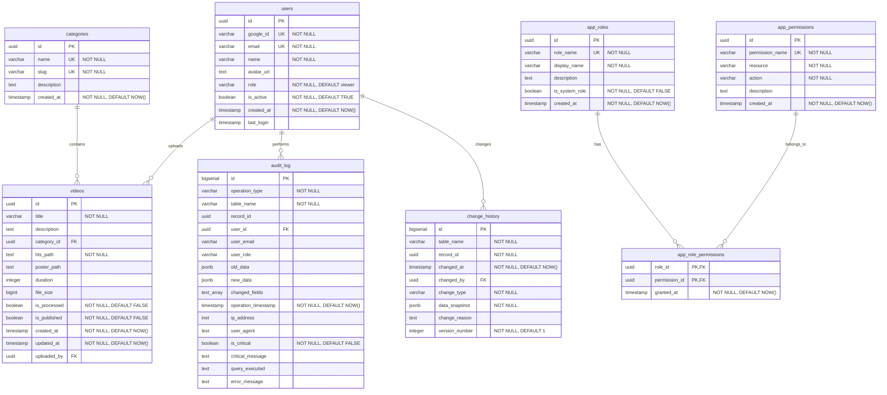
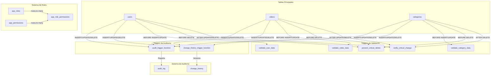

# StreamFlow - Diagrama de Base de Datos

## Diagrama ER (Entity-Relationship)

## Diagrama de Seguridad y Auditoría

## Índices Principales

### Tabla: users
- `idx_users_google_id` - Índice en google_id
- `idx_users_email` - Índice en email
- `idx_users_role` - Índice en role
- `idx_users_is_active` - Índice en is_active

### Tabla: videos
- `idx_videos_category_id` - Índice en category_id
- `idx_videos_is_processed` - Índice en is_processed
- `idx_videos_is_published` - Índice en is_published
- `idx_videos_uploaded_by` - Índice en uploaded_by
- `idx_videos_created_at` - Índice DESC en created_at

### Tabla: categories
- `idx_categories_slug` - Índice en slug

### Tabla: audit_log
- `idx_audit_log_operation_type` - Índice en operation_type
- `idx_audit_log_table_name` - Índice en table_name
- `idx_audit_log_user_id` - Índice en user_id
- `idx_audit_log_timestamp` - Índice DESC en operation_timestamp
- `idx_audit_log_is_critical` - Índice parcial en is_critical
- `idx_audit_log_record_id` - Índice en record_id
- `idx_audit_log_old_data` - Índice GIN en old_data (JSONB)
- `idx_audit_log_new_data` - Índice GIN en new_data (JSONB)

### Tabla: change_history
- `idx_change_history_table_record` - Índice compuesto en (table_name, record_id)
- `idx_change_history_changed_at` - Índice DESC en changed_at
- `idx_change_history_changed_by` - Índice en changed_by
- `idx_change_history_version` - Índice compuesto en (table_name, record_id, version_number)
- `idx_change_history_data_snapshot` - Índice GIN en data_snapshot (JSONB)

## Restricciones (Constraints)

### users
- **NOT NULL**: google_id, email, name, role, is_active, created_at
- **UNIQUE**: google_id, email
- **CHECK**: 
  - Email válido (formato regex)
  - Rol válido (viewer, editor, admin, superadmin)
  - Nombre no vacío
  - Google ID no vacío

### categories
- **NOT NULL**: name, slug, created_at
- **UNIQUE**: name, slug
- **CHECK**:
  - Nombre no vacío
  - Slug no vacío
  - Slug formato válido (lowercase, números, guiones)

### videos
- **NOT NULL**: title, hls_path, is_processed, is_published, created_at, updated_at
- **CHECK**:
  - Título no vacío
  - HLS path no vacío
  - Duración positiva (si existe)
  - File size positivo (si existe)
  - updated_at >= created_at

### audit_log
- **NOT NULL**: operation_type, table_name, operation_timestamp, is_critical
- **CHECK**:
  - operation_type válido (INSERT, UPDATE, DELETE, SELECT, TRUNCATE)
  - table_name no vacío
  - Si is_critical=TRUE, debe tener critical_message

### change_history
- **NOT NULL**: table_name, record_id, changed_at, change_type, data_snapshot, version_number
- **CHECK**:
  - table_name no vacío
  - change_type válido (CREATED, UPDATED, DELETED, RESTORED)
  - version_number > 0

## Llaves Foráneas

- `videos.category_id` → `categories.id` (ON DELETE SET NULL)
- `videos.uploaded_by` → `users.id` (ON DELETE SET NULL)
- `audit_log.user_id` → `users.id` (ON DELETE SET NULL)
- `change_history.changed_by` → `users.id` (ON DELETE SET NULL)
- `app_role_permissions.role_id` → `app_roles.id` (ON DELETE CASCADE)
- `app_role_permissions.permission_id` → `app_permissions.id` (ON DELETE CASCADE)

## Triggers Configurados

### Auditoría (AFTER)
- `trg_audit_users_insert` - AFTER INSERT ON users
- `trg_audit_users_update` - AFTER UPDATE ON users
- `trg_audit_users_delete` - AFTER DELETE ON users
- `trg_audit_categories_insert` - AFTER INSERT ON categories
- `trg_audit_categories_update` - AFTER UPDATE ON categories
- `trg_audit_categories_delete` - AFTER DELETE ON categories
- `trg_audit_videos_insert` - AFTER INSERT ON videos
- `trg_audit_videos_update` - AFTER UPDATE ON videos
- `trg_audit_videos_delete` - AFTER DELETE ON videos

### Historial de Cambios (AFTER)
- `trg_change_history_users_*` - Versionado de usuarios
- `trg_change_history_categories_*` - Versionado de categorías
- `trg_change_history_videos_*` - Versionado de videos

### Validación (BEFORE)
- `trg_validate_user_before_insert/update` - Valida datos de usuarios
- `trg_validate_category_before_insert/update` - Valida datos de categorías
- `trg_validate_video_before_insert/update` - Valida datos de videos
- `trg_prevent_*_critical_delete` - Previene eliminaciones críticas

### Notificaciones (AFTER)
- `trg_notify_users_critical_changes` - Notifica cambios críticos en usuarios
- `trg_notify_videos_critical_changes` - Notifica cambios críticos en videos
- `trg_notify_categories_critical_changes` - Notifica eliminación de categorías

### Actualizaciones Automáticas (BEFORE)
- `trg_update_videos_updated_at` - Actualiza updated_at automáticamente

## Roles de PostgreSQL

### streamflow_readonly
- **Permisos**: SELECT en categories, videos
- **Uso**: Reportes y consultas de solo lectura

### streamflow_app
- **Permisos**: SELECT, INSERT, UPDATE, DELETE en users, categories, videos
- **Permisos**: SELECT, INSERT en audit_log, change_history
- **Uso**: Usuario principal de la aplicación backend

### streamflow_admin
- **Permisos**: ALL PRIVILEGES en todas las tablas
- **Uso**: Tareas administrativas

### streamflow_auditor
- **Permisos**: SELECT en audit_log, change_history, categories
- **Uso**: Auditoría y revisión de logs
